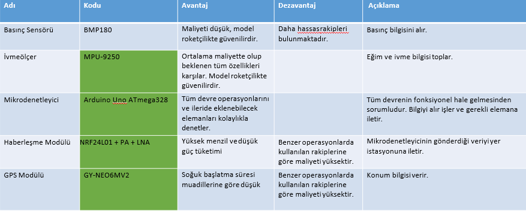
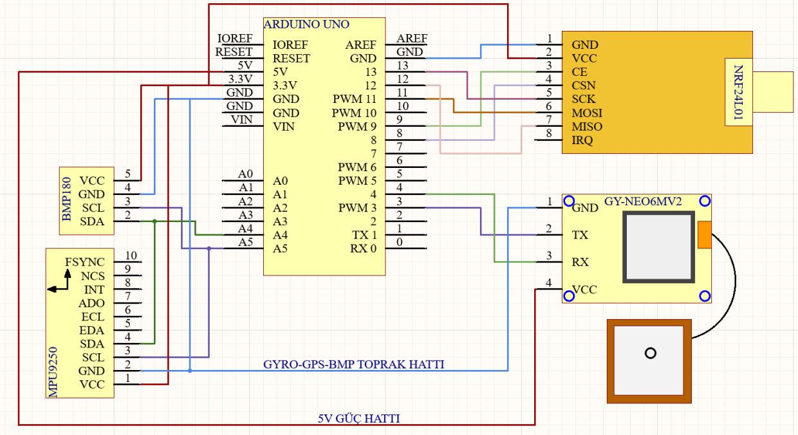
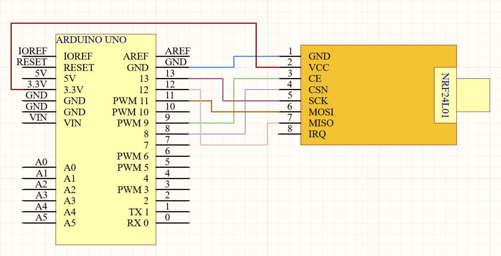
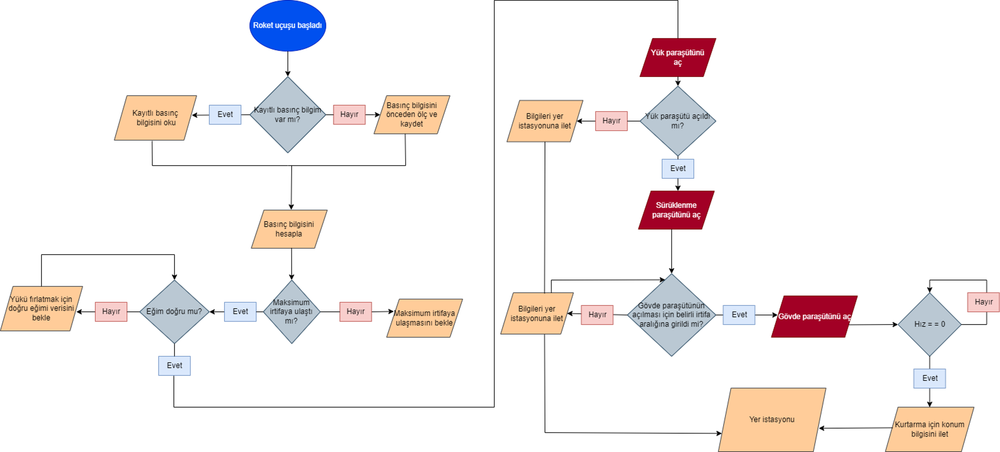

# Roket-Aviyonik-Sistem
 BMP180,MPU-9250,GY-NEO6MV2 sensörleri roketin uçuş değerini alır  ve  NRF240l01 yardımı ile Ana aviyonik sistem ile  Yedek aviyonik sistem arasındaki bağlantıyı sağlar

Neden bu sensörleri seçtik

Özgün uçuş kartının blok devre diyagramı

Yer istasyonu blok devre diyagramı

GPS modülümüzden konum verisi, barometrik sensörümüzden basınç ve irtifa verisi, ivme ölçer modülümüzden ivme ve  eğim bilgisi yer istasyonuna aktarılacaktır.

Veriler 433MHz bandında RF veri paketleriyle iletileceklerdir.

Roket istenilen irtifaya ulaştığı anda burun konisinin  açılmasıyla beraber, görev yükü paraşütüne bağlı şok  kordonu ile kurtarılması hedeflenmektedir.
Burun konisinin serbest kalmasıyla oluşan basınçla  roketten ayrılması hedeflenmektedir.
Görev yükünün kütlesi : 2500 gram

Görev yükü üzerindeki konum belirleme sisteminin elemanları özgün uçuş bilgisayarımızın devre elemanlarıyla oldukça  benzerdir. En önemli farkları görev yükü üzerinde bulunacak bilgisayarın yalnızca konum bildirmesi ve kurtarmayı  kolaylaştıracak elemanlar içermesidir.

AKIŞ DİYAGRAMI

